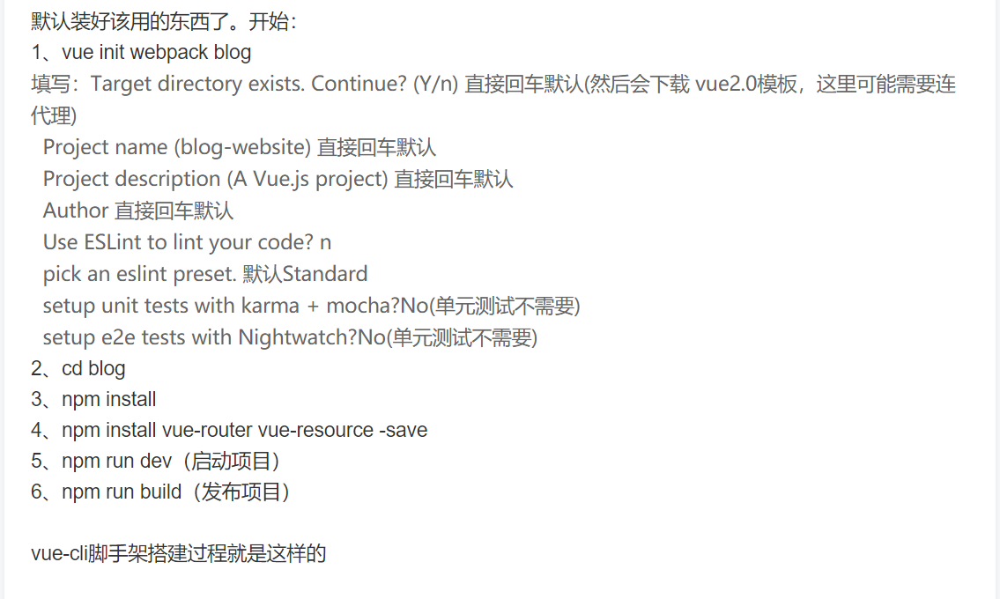
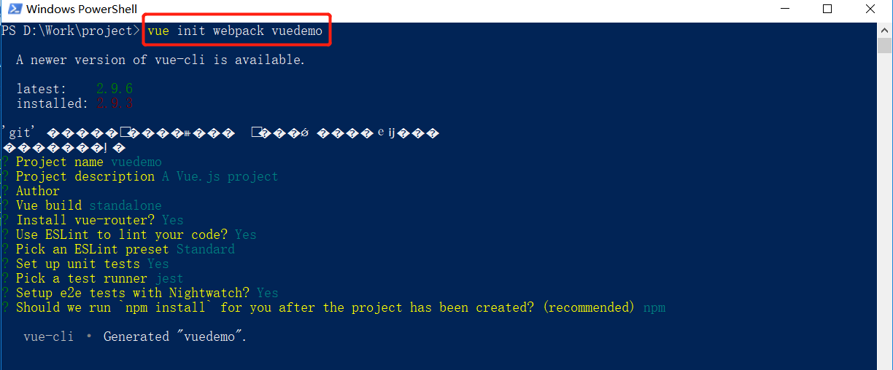
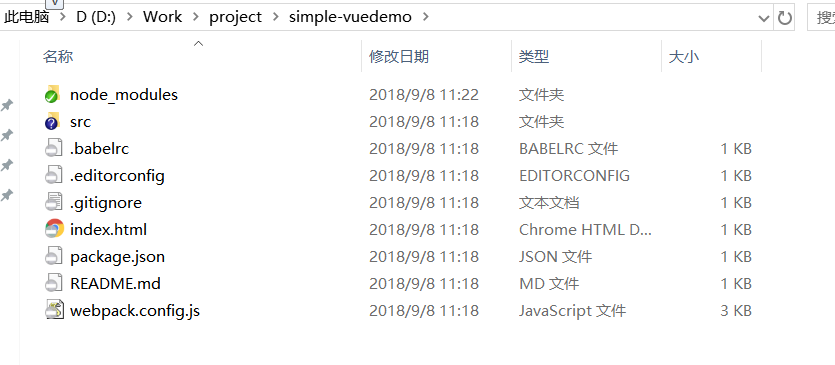

## vue项目的构建
- 我们首先，需要安装vue-cil

```
    $ npm install -g vue-cli
```

- 做Vue项目，搭建环境避免不了。一开始学习的时候，还是先学webpack的基本知识，一步一步配置入口文件等等.命令vue init webpack有两种版本，一个simple版vue init webpack-simple，simple版不带eslink语法检查、单元测试；vue init webpack带全功能

    - browserify--全功能的Browserify + vueify，包括热加载，静态检测，单元测试

    - browserify-simple--一个简易的Browserify + vueify，以便于快速开始。

    - webpack--全功能的Webpack + vueify，包括热加载，静态检测，单元测试

    - webpack-simple--一个简易的Webpack + vueify，以便于快速开始。

## 开始


     - vue init webpack vuedemo 与 vue init webpack-simple simple-vuedemo的区别

```
    $ vue init webpack vue dome 
```



[webpack项目目录](https://github.com/success666/Work/tree/master/vuedemo "webpack-simple项目目录")


```
    $ vue init webpack-simple simple-vuedemo
```




[webpack-simple项目目录](https://github.com/success666/vueProject "webpack-simple项目目录")


- build/                     # webpack配置文件

- config/
    -index.js                # 主要项目配置

    - src/
    - main.js                # 应用入口文件
    - App.vue                 # 主应用程序组件
    - components/             # ui组件

    - assets/                 # 模块资源（由webpack处理）
- static/                     # 纯静态资源（直接复制）
- test/
    - unit/                   # 单元测试
        - specs/              # 测试spec文件
        - index.js            # 测试构建条目文件
        - karma.conf.js       # 测试跑步者配置文件
    - e2e/                    # e2e测试
         - specs/              # 测试spec文件
        - custom-assertions/  # e2e测试的自定义断言
        - runner.js           # 测试跑步脚本
        - nightwatch.conf.js  # 测试跑步者配置文件
- .babelrc                    # babel 配置
- .postcssrc.js               # postcss 配置
- .eslintrc.js                # eslint 配置
- .editorconfig               # editor 配置
- index.html                  # index.html模板
- package.json                # 构建脚本和依赖关系

## 了解更多的vue的语法以及vue-cli [点击这里](https://github.com/success666/Vue "点击这里")


## Vue 面包屑导航

- element ui + vue 面包屑导航 
- vue [vue教程](https://cn.vuejs.org/v2/guide/ "vue教程")
- element ui [element ui教程](https://cn.element uijs.org/v2/guide/ "element ui教程")

```
html部分

<template>
    <el-breadcrumb>
        <el-breadcrumb-item separator = '/' v-for = "(item,index) in breadlist" :key = 'index' :to="{path: item.path}">
            {{item.meta.CName}}
        </el-breadcrumb-item>
    </el-breadcrumb>
</template>

js部分

<script>
export default {
    data(){
        return {
            breadlist: ''
        }
    },
    created() {
        this.getBread();
    },
    methods:{
        getBread(){
            this.breadlist = this.$route.matched;
            this.$route.matched.forEach((item,index)=>{
                //先判断父级路由是否是空字符串或者meta是否为首页，直接复写路径到根路径
                item.meta.CName === '首页' ? item.path = '/' : this.$route.path === item.path;
            });
        }
    },
    watch:{
        $route(){
            this.getBread();
        }
    }
}
</script>
```

### token解析 - base64解码
```
    let tokenObj = decodeURIComponent(atob(token).split('').map(function(c) {
        return '%' + ('00' + c.charCodeAt(0).toString(16)).slice(-2);
    }).join(''));
```

## element ui + vue  xlsx导出 导入
```
<template>
    <div class="index" v-loading.fullscreen.lock="fullscreenLoading" element-loading-text="拼命加载中...">
        <!--导入使用-->
        <input type="file" @change="importFile(this)" id="imFile" style="display: none"
            accept="application/vnd.openxmlformats-officedocument.spreadsheetml.sheet, application/vnd.ms-excel"/>
        <el-button class="button" @click="uploadFile()">导入</el-button>

        <!--导出使用-->
        <a id="downlink"></a>
        <el-button class="button" @click="downloadFile(excelData)">导出</el-button>


        <!--错误信息提示   可以不要-->
        <el-dialog title="提示" v-model="errorDialog" size="tiny">
            <span>{{errorMsg}}</span>
            <span slot="footer" class="dialog-footer">
                <el-button type="primary" @click="errorDialog=false">确认</el-button>
            </span>
        </el-dialog>
        <!--展示导入信息 -->
        <el-table :data="excelData" tooltip-effect="dark">
            <el-table-column label="名称" prop="name" show-overflow-tooltip></el-table-column>
            <el-table-column label="分量" prop="size" show-overflow-tooltip></el-table-column>
            <el-table-column label="口味" prop="taste" show-overflow-tooltip></el-table-column>
            <el-table-column label="单价(元)" prop="price" show-overflow-tooltip></el-table-column>
            <el-table-column label="剩余(份)" prop="remain" show-overflow-tooltip></el-table-column>
        </el-table>
    </div>
</template>

<script>

    // 引入xlsx
    // var XLSX = require('xlsx')
    import XLSX from 'xlsx'

    export default {
        name: 'Index',
        data() {
        return {
            fullscreenLoading: false, // 加载中  不需要
            imFile: '', // 导入文件el
            outFile: '', // 导出文件el
            errorDialog: false, // 错误信息弹窗
            errorMsg: '', // 错误信息内容
            excelData: [ // 测试数据
                {
                    name: '红烧鱼', size: '大', taste: '微辣', price: '40', remain: '100'
                },
                {
                    name: '麻辣小龙虾', size: '大', taste: '麻辣', price: '138', remain: '200'
                },
                {
                    name: '清蒸小龙虾', size: '大', taste: '清淡', price: '138', remain: '200'
                },
                {
                    name: '香辣小龙虾', size: '大', taste: '特辣', price: '138', remain: '200'
                },
                {
                    name: '十三香小龙虾', size: '大', taste: '中辣', price: '138', remain: '108'
                },
                {
                    name: '蒜蓉小龙虾', size: '大', taste: '中辣', price: '138', remain: '100'
                },
                {
                    name: '凉拌牛肉', size: '中', taste: '中辣', price: '48', remain: '60'
                },
                {
                    name: '虾仁寿司', size: '大', taste: '清淡', price: '29', remain: '无限'
                },
                {
                    name: '海苔寿司', size: '大', taste: '微辣', price: '26', remain: '无限'
                },
                {
                    name: '金针菇寿司', size: '大', taste: '清淡', price: '23', remain: '无限'
                },
                {
                    name: '泡菜寿司', size: '大', taste: '微辣', price: '24', remain: '无限'
                },
                {
                    name: '鳗鱼寿司', size: '大', taste: '清淡', price: '28', remain: '无限'
                },
                {
                    name: '肉松寿司', size: '大', taste: '清淡', price: '22', remain: '无限'
                },
                {
                    name: '三文鱼寿司', size: '大', taste: '清淡', price: '30', remain: '无限'
                },
                {
                    name: '蛋黄寿司', size: '大', taste: '清淡', price: '20', remain: '无限'
                }
            ]
        }
    },
    mounted() {
        this.imFile = document.getElementById('imFile'); // 导入使用

        this.outFile = document.getElementById('downlink') // 导出使用
    },
    methods: {

        uploadFile: function() { // 点击导入按钮
            this.imFile.click()
        }, // 导入按钮

        downloadFile: function(rs) { // 点击导出按钮
            console.log(rs);
            let data = [{}]
            for (let k in rs[0]) {
                data[0][k] = k
            }
            data = data.concat(rs)
            this.downloadExl(data, '菜单')
        }, // 导出按钮

        downloadExl: function(json, downName, type) {  // 导出到excel
            let keyMap = []; // 获取键
            console.log(json)
            // 中文名
            json[0] = {name:"名称",size:"份量",taste:"口味",price:"单价(元)",remain:"剩余(份)"}
            for (let k in json[0]) {
                console.log(k);
                keyMap.push(k)
            }

            console.info('keyMap', keyMap, json)
            let tmpdata = []; // 用来保存转换好的json
            json.map((v, i) => keyMap.map((k, j) => Object.assign({}, {
                v: v[k],
                position: (j > 25 ? this.getCharCol(j) : String.fromCharCode(65 + j)) + (i + 1)

            }))).reduce((prev, next) => prev.concat(next)).forEach(function (v) {
                tmpdata[v.position] = { v: v.v }
            });


            let outputPos = Object.keys(tmpdata); // 设置区域,比如表格从A1到D10
                let tmpWB = {
                    SheetNames: ['mySheet'], // 保存的表标题
                    Sheets: {
                        'mySheet': Object.assign({},
                        tmpdata, // 内容
                        {
                            '!ref': outputPos[0] + ':' + outputPos[outputPos.length - 1] // 设置填充区域
                        })
                    }
                };

            console.log(tmpWB)
            let tmpDown = new Blob([this.s2ab(XLSX.write(tmpWB,
                { bookType: (type === undefined ? 'xlsx' : type), bookSST: false, type: 'binary' } // 这里的数据是用来定义导出的格式类型
            ))], {
                type: ''
            }) // 创建二进制对象写入转换好的字节流
            var href = URL.createObjectURL(tmpDown); // 创建对象超链接
            this.outFile.download = downName + '.xlsx'; // 下载名称
            this.outFile.href = href; // 绑定a标签
            this.outFile.click(); // 模拟点击实现下载
            setTimeout(function() { // 延时释放
                URL.revokeObjectURL(tmpDown) // 用URL.revokeObjectURL()来释放这个object URL
            }, 100)
        }, // 导出使用


        s2ab: function(s) { // 字符串转字符流
            var buf = new ArrayBuffer(s.length)
            var view = new Uint8Array(buf)
            for (var i = 0; i !== s.length; ++i) {
                view[i] = s.charCodeAt(i) & 0xFF
            }
            return buf
        }, // 导出

        getCharCol: function(n) { // 将指定的自然数转换为26进制表示。映射关系：[0-25] -> [A-Z]。
            let s = '';
            let m = 0;
            while (n > 0) {
                m = n % 26 + 1;
                s = String.fromCharCode(m + 64) + s;
                n = (n - m) / 26
            }
            console.log('sssss',s);
            return s
        }, // 导出

        importFile: function() { // 导入excel
            this.fullscreenLoading = true;
            let obj = this.imFile;
            if (!obj.files) {
                this.fullscreenLoading = false;
                return
            }
            var f = obj.files[0]
            var reader = new FileReader()
            let $t = this
            reader.onload = function (e) {
                var data = e.target.result
                if ($t.rABS) {
                    $t.wb = XLSX.read(btoa(this.fixdata(data)), { // 手动转化
                        type: 'base64'
                    })
                } else {
                    $t.wb = XLSX.read(data, {
                        type: 'binary'
                    })
                }
                let json = XLSX.utils.sheet_to_json($t.wb.Sheets[$t.wb.SheetNames[0]])
                console.log(typeof json)
                $t.dealFile($t.analyzeData(json)) // analyzeData: 解析导入数据
            }

            if (this.rABS) {
                reader.readAsArrayBuffer(f)
            } else {
                reader.readAsBinaryString(f)
            }
        }, // 导入


        analyzeData: function(data) { // 此处可以解析导入数据
            return data
        }, // 导入
        dealFile: function(data) { // 处理导入的数据
            console.log(data)
            this.imFile.value = ''
            this.fullscreenLoading = false
            if (data.length <= 0) {
                this.errorDialog = true
                this.errorMsg = '请导入正确信息'
            } else {
                this.excelData = data
            }
        }, // 导入

        fixdata: function(data) { // 文件流转BinaryString
            var o = ''
            var l = 0
            var w = 10240
            for (; l < data.byteLength / w; ++l) {
                o += String.fromCharCode.apply(null, new Uint8Array(data.slice(l * w, l * w + w)))
            }
            o += String.fromCharCode.apply(null, new Uint8Array(data.slice(l * w)))
            return o
        } // 导入
    }
  }
</script>

<!-- Add "scoped" attribute to limit CSS to this component only -->
<style>
    .el-table th>.cell {
        text-align: center;
    }
    .button {
        margin-bottom: 20px;
    }
</style>

```
